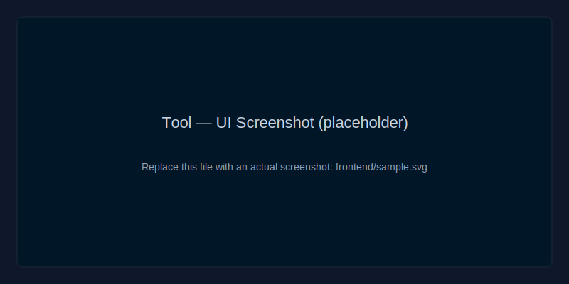

 # Tool — Generic Evaluation Platform

 [](LICENSE)
 [](#)
 [](#)

 Short one-line description of what this project does.

 ## Quick Start

 1. Clone the repo
 2. Install dependencies
 3. Run the dev server

 ## Screenshot

 

 Evaluate **a process, a system, or customer sentiment** — quickly and easily.
 Weighted criteria → score (0-100) → grade (A→E). Export tickets as **PDF / JSON**,
 **documented REST API** for integration, and **chatbot** connected to a **local open.source
 source
or customer sentiment using weighted criteria. It provides a simple UI for
creating evaluation templates and recording evaluations (tickets), a REST API for
integration, export capabilities (PDF/JSON/HTML), and a chatbot that answers
questions about recorded evaluations. The chatbot prefers a local model (Ollama)
but falls back to a deterministic rule-based responder when no model is
available — making the app deployable without hosting heavy model infrastructure.

Tech stack (detailed)
----------------------
- Frontend: React + Vite + Tailwind CSS. Main UI lives in [frontend/src/App.jsx](frontend/src/App.jsx#L1).
- Backend: FastAPI (Python) providing a REST API and serverless entry in [api/index.py](api/index.py#L1).
- Model client: Ollama client adapter in [backend/app/ollama_client.py](backend/app/ollama_client.py#L1) with a software fallback for offline usage.
- Storage: simple JSON persistence with optional Postgres support (configurable via `DATA_DIR`). See [backend/app/storage.py](backend/app/storage.py#L1).
- PDF export: server-side PDF generation using WeasyPrint (backend PDF utility in [backend/app/pdf.py](backend/app/pdf.py#L1)).
- Parsing & upload helpers: frontend supports JSON/YAML/CSV/.docx/.pdf template uploads and extracts structured templates client-side (`frontend/src/App.jsx`).
- Dev / local: Docker Compose orchestrates `frontend`, `backend` and `ollama` for single-machine testing.

Architecture diagram
--------------------
```mermaid
```mermaid
flowchart TB
  UI[Frontend: React / Vite / Tailwind]
  API[FastAPI backend]
  PDF[WeasyPrint]
  MODEL[Ollama (local)]
  UI -->|REST /api/v1| API
  API -->|store| Storage[(JSON / Postgres)]
  API -->|export| PDF
  API -->|inference| MODEL
```


## Architecture

```
Frontend (React/Vite/Tailwind)  ──►  REST API (FastAPI)  ──►  Ticket storage (JSON / Postgres)
        │                                   │
        └── chatbot widget ────────────────►└──►  Ollama (Mistral 7B) — local inference
                                            └──►  WeasyPrint — server PDF generation
```

Three decoupled layers. The API is the **only contract**: the UI is just a client, and
any third-party application can consume the same endpoints.

## Quick start (Docker — all-in-one)

```bash
docker compose up --build
# Download the model (once):
docker compose exec ollama ollama pull mistral:7b-instruct
```

- Application: http://localhost:8080
- API + Swagger: http://localhost:8000/docs

## Local start (without Docker)

**Backend**
```bash
cd backend
python -m venv .venv && source .venv/bin/activate
pip install -r requirements.txt
uvicorn app.main:app --reload          # http://localhost:8000/docs
```

**Frontend**
```bash
cd frontend
npm install
npm run dev                            # http://localhost:5173 (proxy /api -> :8000)
```

**Chatbot (open source model)**
```bash
# https://ollama.com
ollama pull mistral:7b-instruct
ollama serve
```
If Ollama is not running, the chatbot returns a fallback response based on the
tickets: the tool remains usable.

## Endpoints

| Method | Endpoint | Purpose |
|--------|----------|---------|
| GET  | `/api/v1/templates` | Templates + criteria + scope (covered/not covered) |
| POST | `/api/v1/evaluations` | Create an evaluation → ticket (score + grade) |
| GET  | `/api/v1/tickets` | List tickets |
| GET  | `/api/v1/tickets/{id}` | Ticket details |
| GET  | `/api/v1/tickets/{id}/export?format=pdf\|json\|html` | Export |
| POST | `/api/v1/chat` | Ask the chatbot (context = tickets) |
| GET  | `/api/v1/health` | API health check |

Example:
```bash
curl -X POST http://localhost:8000/api/v1/evaluations -H "Content-Type: application/json" -d '{
  "template_id": "process",
  "subject": "Onboarding process",
  "scores": {"steps": 8, "bottlenecks": 6, "compliance": 9, "automation": 5, "repeatability": 7}
}'
```

## Configuration (backend environment variables)

| Variable | Default | Purpose |
|----------|--------|---------|
| `OLLAMA_URL` | `http://localhost:11434` | Ollama URL |
| `OLLAMA_MODEL` | `mistral:7b-instruct` | Model (plan B: `llama3:8b`) |
| `CORS_ORIGINS` | `*` | Allowed origins (restrict in production) |
| `API_KEY` | *(empty)* | If set, requires the `X-API-Key` header |
| `DATA_DIR` | `backend/data` | Ticket persistence folder |

## Evaluation model

Score = weighted average of criterion attainment (`score / max`), normalized to 100.
Grades: **A** ≥85 · **B** ≥70 · **C** ≥55 · **D** ≥40 · **E** <40 (thresholds are adjustable).
Each template exposes an **explicit scope**: what it covers and what it does not cover
(with a link to the appropriate template).

## Security

Local inference (no data leakage), optional API key, Pydantic input validation,
configurable CORS, TLS encryption recommended at the edge. See the project briefing
(`cadrage-projet-tool.html`) for the full risk register.

## Structure

```
backend/   FastAPI — app/{main,config,models,scoring,storage,pdf,ollama_client}, routers/
frontend/  React/Vite — src/{App.jsx,api.js,...}
docker-compose.yml   frontend + backend + ollama
```

For better chatbot answers later, you can:
- Self‑host Ollama on a suitable VM/container and set `OLLAMA_URL`.
- Or I can add a hosted‑inference adapter (Hugging Face / Replicate) so the backend calls a hosted API instead of Ollama.
```
