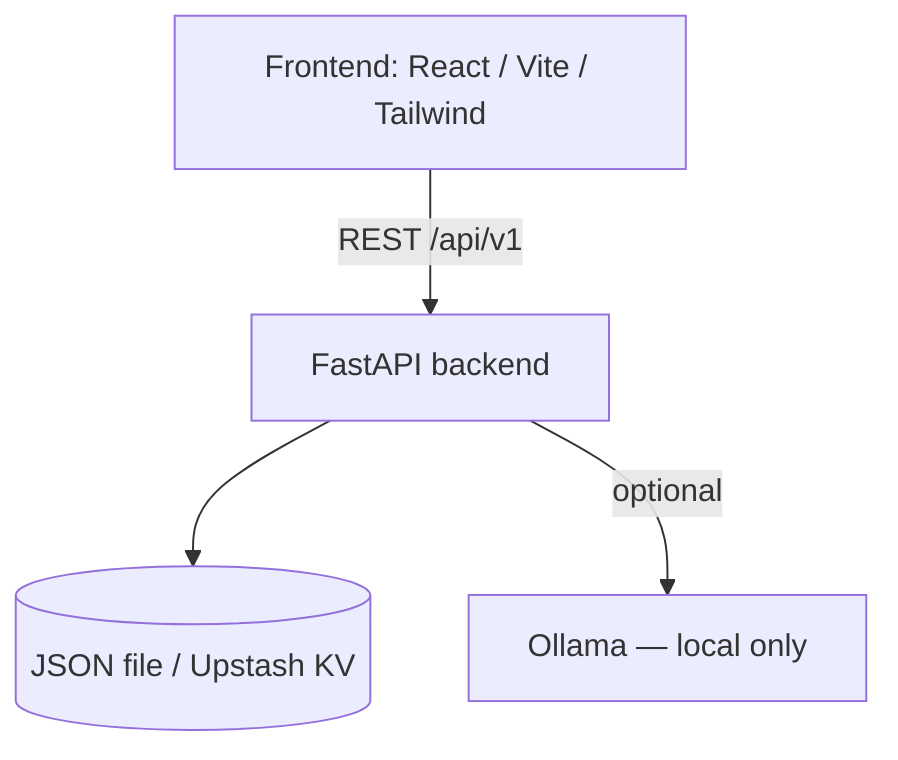

# Tool — Generic Evaluation Platform

[](LICENSE)
[](#test-suite)

Evaluate a **process**, a **system**, or **customer sentiment** using weighted criteria.
Scores normalise to 0-100 and map to grades A→E. Results are saved as tickets exportable
as PDF (via browser print) or JSON. A REST API exposes all features for integration, and
a chatbot answers questions about recorded tickets.

## Architecture

```
Frontend (React/Vite/Tailwind)  ──►  REST API (FastAPI)  ──►  Ticket storage (JSON / Upstash KV)
        │                                   │
        └── chatbot widget ────────────────►└──►  Ollama (local, optional) — fallback: rule-based
```



## Quick start (Docker — all-in-one)

```bash
docker compose up --build
# Download the model once (optional — chatbot works without it):
docker compose exec ollama ollama pull mistral:7b-instruct
```

- Application: http://localhost:8080
- API + Swagger: http://localhost:8000/docs

## Local start (without Docker)

**Backend**
```bash
cd backend
python -m venv .venv && source .venv/bin/activate   # Windows: .venv\Scripts\activate
pip install -r requirements.txt
uvicorn app.main:app --reload          # http://localhost:8000/docs
```

**Frontend**
```bash
cd frontend
npm install
npm run dev                            # http://localhost:5173 (proxy /api → :8000)
```

**Chatbot (local open-source model — optional)**
```bash
# https://ollama.com
ollama pull mistral:7b-instruct
ollama serve
```

> **Chatbot limitations**
>
> Ollama runs **locally only**. On Vercel and other cloud deployments where Ollama is not
> running, the chatbot automatically falls back to a deterministic rule-based responder
> (lowest/highest score, average, ticket list). This fallback is labelled `model: fallback`
> in the UI. To enable real inference in the cloud, self-host Ollama on a VM/container and
> set `OLLAMA_URL` to point at it.

## Endpoints

| Method | Endpoint | Purpose |
|--------|----------|---------|
| GET  | `/api/v1/templates` | Templates + criteria + scope |
| POST | `/api/v1/evaluations` | Create evaluation → ticket (score + grade) |
| GET  | `/api/v1/tickets` | List tickets |
| GET  | `/api/v1/tickets/{id}` | Ticket detail |
| GET  | `/api/v1/tickets/{id}/export?format=pdf\|json\|html` | Export |
| POST | `/api/v1/chat` | Ask the chatbot (context = tickets) |
| GET  | `/api/v1/health` | Health check |

```bash
curl -X POST http://localhost:8000/api/v1/evaluations \
  -H "Content-Type: application/json" \
  -d '{"template_id":"process","subject":"Onboarding","scores":{"steps":8,"bottlenecks":6,"compliance":9,"automation":5,"repeatability":7}}'
```

## Configuration

| Variable | Default | Purpose |
|----------|---------|---------|
| `OLLAMA_URL` | `http://localhost:11434` | Ollama endpoint |
| `OLLAMA_MODEL` | `mistral:7b-instruct` | Model name |
| `CORS_ORIGINS` | `*` | Comma-separated allowed origins (restrict in production) |
| `API_KEY` | *(empty)* | If set, requires `X-API-Key` header on all requests |
| `DATA_DIR` | `backend/data` | Ticket storage folder (JsonStore) |
| `KV_REST_API_URL` | *(empty)* | Upstash / Vercel KV URL — activates cloud persistence |
| `KV_REST_API_TOKEN` | *(empty)* | Upstash / Vercel KV token |

### Enabling Vercel KV persistence

1. In your Vercel project dashboard add the **KV** integration.
2. Vercel automatically injects `KV_REST_API_URL` and `KV_REST_API_TOKEN`.
3. The backend detects them on startup and switches from the ephemeral `/tmp` JSON store
   to the Upstash Redis store automatically. No code change needed.

## PDF export

PDF is produced **client-side** via the browser's native print dialog (`window.print()`).
Clicking the PDF button opens a styled, print-optimised HTML page; the print dialog appears
automatically. No native system libraries (WeasyPrint / Pango / Cairo) are required.

## Evaluation model

Score = weighted average of criterion attainment (`value / max`), normalised to 100.

| Grade | Threshold |
|-------|-----------|
| A — Excellent | ≥ 85 |
| B — Bon | ≥ 70 |
| C — À surveiller | ≥ 55 |
| D — Insuffisant | ≥ 40 |
| E — Critique | < 40 |

## Test suite

```bash
cd backend
pip install -r requirements-dev.txt
pytest -v
```

Tests cover: scoring logic, JsonStore CRUD, and all REST endpoints (evaluations, tickets,
export formats, health).

## Structure

```
backend/
  app/  main · config · models · scoring · storage · pdf · ollama_client
  routers/  templates · evaluations · tickets · chat
  tests/    test_scoring · test_storage · test_api
  requirements.txt          runtime deps
  requirements-dev.txt      + pytest
api/
  index.py          Vercel ASGI shim
  requirements.txt  mirrors backend/requirements.txt
frontend/
  src/  App.jsx · api.js
docker-compose.yml  frontend + backend + ollama
```
