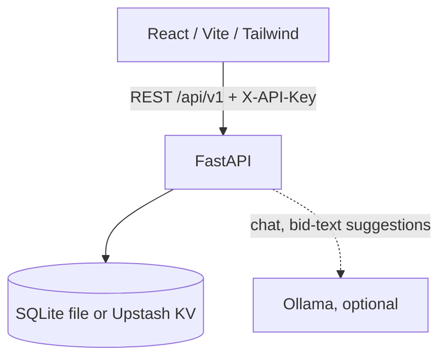

# Tool — evaluation and tender workbench

[](LICENSE)

Score a **process**, a **system** or a **customer** against weighted criteria, or run a
**tender evaluation**: independent blind scoring by several evaluators, consensus on
disputed criteria, a sealed ranking, and an analysis of whether a different weighting
would have changed the winner.

- **Evaluations** → score 0–100 → grade A–E, saved as tickets (PDF via print, JSON).
- **Custom templates**, versioned: import JSON / YAML / CSV, and every ticket pins the
  version it was scored against.
- **Tender workbench**: blind scoring with mandatory written justifications, divergence
  flags, consensus, award, award report and per-bidder debrief letters.
- **Weight-sensitivity analysis**: the exact weight change at which another bid takes the lead.
- **Tamper-evident records**: tickets and the audit log are hash-chained.
- **Organisation-scoped API keys**, a REST API (Swagger at `/docs`) and a chatbot over your tickets.

## Architecture


```mermaid
flowchart TB
  UI[React / Vite / Tailwind]
  API[FastAPI]
  STORE[(SQLite file or Upstash KV)]
  LLM[Ollama, optional]
  UI -->|REST /api/v1 + X-API-Key| API
  API --> STORE
  API -.->|chat, bid-text suggestions| LLM
```

`backend/app/`: `routers/` (HTTP), `repo.py` (hash-chained tickets and audit log, versioned
templates, tenders), `tenders.py` (workflow rules), `sensitivity.py`, `scoring.py`,
`proposers.py` (evidence/score suggestions), `storage.py` (SQLite and Upstash document
stores), `auth.py`, `ratelimit.py`.

## Quick start

**Docker (everything, including a local model)**
```bash
docker compose up --build
docker compose exec ollama ollama pull mistral:7b-instruct   # optional
```
App at http://localhost:8080, API docs at http://localhost:8000/docs.

**Local**
```bash
cd backend && python -m venv .venv && source .venv/bin/activate   # Windows: .venv\Scripts\activate
pip install -r requirements-dev.txt
uvicorn app.main:app --reload          # http://localhost:8000/docs
```
```bash
cd frontend && npm install && npm run dev   # http://localhost:5173 (proxies /api to :8000)
```

## Authentication and organisations

Set `API_KEYS="key1:org-a:alice,key2:org-b"` (key, organisation, optional label). Send the key
in the `X-API-Key` header; the UI has an **API key** button. Each key sees only its own
organisation's tickets, templates, tenders and audit log, and the label is recorded as the
actor in the audit log. **With keys on, the label is also the evaluator identity:** a key may
only submit scores as its own label, so give each committee member a key labelled with their
evaluator name (`key:org:alice`). An organiser key (any other label) can create tenders, close
scoring and award, but cannot score. `GET /me` returns the caller's organisation and label. Without any keys the server runs in **open mode**: everyone shares one
organisation named `default`. Do not expose open mode publicly. `GET /health` and
`POST /sensitivity` stay open (the latter stores nothing).

## Tender workflow

1. **Create** a tender from a template. The criteria and weights are snapshotted *now*,
   before any bid is scored.
2. **Blind scoring.** Each evaluator scores every bidder on every criterion and must write a
   justification. The API never returns score values while scoring is open, and the audit log
   never contains them.
3. **Close scoring** (requires every cell filled). Results are revealed. A criterion is
   *divergent* when evaluators' scores differ by more than the tender's threshold (default
   30% of the scale).
4. **Consensus.** Each divergent criterion needs an agreed value and a justification. The
   rest default to the mean.
5. **Award.** The award is claimed atomically (`consensus` → `awarding`), then one sealed ticket
   per bidder is written and the tender becomes `awarded` and read-only. An interrupted award can
   be resumed by calling award again: tickets already written are kept, never duplicated. The
   ranking uses exact totals (equal totals share a rank; there is no automatic tie-break). The
   award report and debrief letters (PDF via print) then become available.

Suggestions from bid text (`POST /tenders/{id}/propose`) are **advice only** and are never saved:
a human enters every score. With `PROPOSER=ollama` a local model proposes a score, a
confidence and a quote; any quote not found verbatim in the text is dropped and the confidence
capped. The default `rules` provider only finds the most relevant passage.

### Sensitivity analysis

For leader *a* and rival *b*, the lead is `N = Σ wⱼ(rₐⱼ − r_bⱼ)`. Scaling one weight by
`(1 + t)` ties the two at `t* = −N / (wᵢ(rₐᵢ − r_bᵢ))`. That is exact, so no sampling is
involved. The result lists, per criterion, the relative change that would let a rival catch up,
and whether it falls inside the plausible-dispute band you choose (default ±20%).

## Evaluation model

Score = weighted average of criterion attainment (`value / max`), 0–100. Every criterion must
be scored and every value must lie within `0..max`; malformed input returns 422 rather than a
silently wrong number.

| Grade | Threshold |
|-------|-----------|
| A — Excellent | ≥ 85 |
| B — Good | ≥ 70 |
| C — Watch | ≥ 55 |
| D — Poor | ≥ 40 |
| E — Critical | < 40 |

## Endpoints

| Method | Endpoint | Purpose |
|--------|----------|---------|
| GET / POST | `/api/v1/templates` | List (latest versions) / create or add a version |
| POST | `/api/v1/templates/import` | Import JSON, YAML or CSV text |
| GET | `/api/v1/templates/{id}[?version=]`, `/versions` | Read a template |
| DELETE | `/api/v1/templates/{id}` | Delete a custom template |
| POST | `/api/v1/evaluations` | Score a subject → sealed ticket |
| GET | `/api/v1/tickets?limit=&offset=`, `/tickets/{id}` | List / detail |
| GET | `/api/v1/tickets/verify` | Verify the hash chain |
| DELETE | `/api/v1/tickets/{id}` | Hide a ticket (it stays in the chain) |
| GET | `/api/v1/tickets/{id}/export?format=pdf\|json\|html` | Export |
| POST/GET | `/api/v1/tenders`, `/tenders/{id}` | Create / read a tender |
| POST | `/tenders/{id}/scores`, `/close-scoring`, `/award` | Workflow steps |
| PUT | `/tenders/{id}/consensus` | Consensus value for a divergent criterion |
| GET | `/tenders/{id}/results`, `/sensitivity`, `/report`, `/debrief/{bidder}` | Analysis and documents |
| POST | `/tenders/{id}/propose` | Evidence / score suggestions (advice only) |
| POST | `/api/v1/sensitivity` | Stateless weight-sensitivity calculator |
| GET | `/api/v1/audit`, `/audit/verify`, `/audit/export` | Audit log |
| POST | `/api/v1/chat` | Ask about your tickets |
| GET | `/api/v1/health`, `/api/v1/me` | Health check; caller's organisation and label |

```bash
curl -X POST http://localhost:8000/api/v1/evaluations \
  -H "Content-Type: application/json" -H "X-API-Key: $KEY" \
  -d '{"template_id":"process","subject":"Onboarding","scores":{"steps":8,"bottlenecks":6,"compliance":9,"automation":5,"repeatability":7}}'
```

## Configuration

| Variable | Default | Purpose |
|----------|---------|---------|
| `API_KEYS` | *(empty)* | `key:org[:label],…`. Empty = open mode |
| `API_KEY` | *(empty)* | Legacy single key, maps to org `default` |
| `DB_PATH` | `backend/data/tool.db` | SQLite file |
| `KV_REST_API_URL`, `KV_REST_API_TOKEN` | *(empty)* | Use Upstash / Vercel KV instead of SQLite |
| `CORS_ORIGINS` | `*` | Comma-separated allowed origins (restrict in production) |
| `OLLAMA_URL`, `OLLAMA_MODEL`, `OLLAMA_TIMEOUT` | `http://localhost:11434`, `mistral:7b-instruct`, `60` | Local model |
| `PROPOSER` | `rules` | `rules` or `ollama` for bid-text suggestions |
| `RATE_LIMIT_PER_MIN` | `30` | Per caller, chat and propose only; `0` disables |

Chatbot without Ollama: it falls back to a deterministic answerer (lowest / highest / average /
list) and labels the reply `model: fallback`.

## Deploying on Vercel

`api/index.py` serves the API. The filesystem is ephemeral there: add the **KV** integration
(Upstash) for persistence, and set `API_KEYS`, otherwise the deployment is open mode.
Ollama does not run on Vercel; point `OLLAMA_URL` at a host you run.

## Known limits

- **Tamper evidence, not tamper proof.** Someone who can rewrite the whole database can rebuild
  a consistent chain. Anchor the head hash (`GET /tickets/verify` → `head`) somewhere you trust.
- **Concurrent writers.** Chain heads and tender documents are updated with compare-and-set
  and retried, so simultaneous writers cannot fork a chain or overwrite each other's scores
  (SQLite: `BEGIN IMMEDIATE`; Upstash: a server-side Lua script). The Upstash path is tested
  against a local HTTP fake of its REST API, not the real service. `verify` run while another
  *process* is mid-append can briefly report a false alarm; re-run it.
- **Evaluator identity** is enforced only when API keys are on. In open mode anyone can score as
  any evaluator.
- **Size.** A tender is capped at 3,000 scores (bidders × criteria × evaluators) because it is
  stored as one document.
- **Soft delete.** Hiding a ticket keeps its record in the chain; erasing personal data
  (GDPR) needs a separate redaction process.
- **PDF** is the browser's print dialog, not a server-rendered file.

## Tests

```bash
cd backend && python -m pytest -q --cov=app      # 204 tests, ~98% line coverage
cd frontend && npm run build && npm audit --omit=dev
```
CI (`.github/workflows/ci.yml`) runs both.
